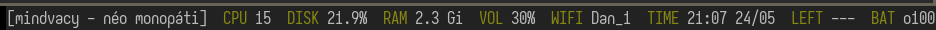

# statux
###### status for X11
simple [slstatus](https://tools.suckless.org/slstatus/) alternative with support for signals and variable updates.
feel free to fork and change `src/main.rs` to your liking :)



## Getting started
### Dependencies
This program depends on some development packages for these following libraries:
 - alsa-lib
 - dbus
 - libX11
 - libxcb

you can find these in almost every package manager.

### Installation
clone the repository
```shell
git clone https://github.com/netfri25/statux
cd statux
```

install the program
```shell
cargo install --path .
```

add it to your `.xinitrc` (or whatever config file you use)
```shell
$HOME/.cargo/bin/statux &
```

enjoy!

